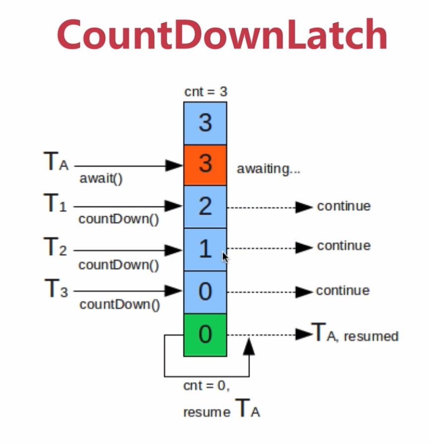
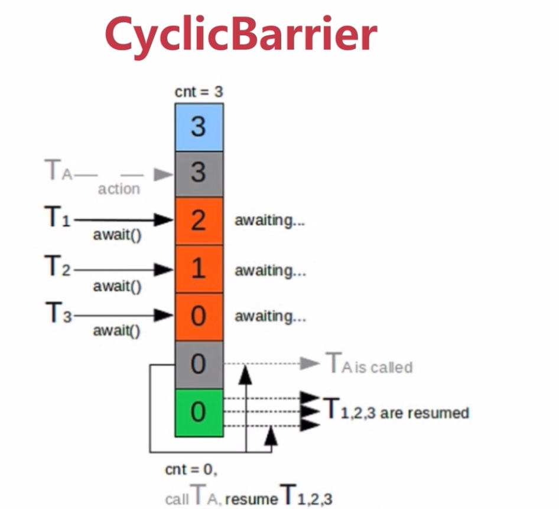

## 线程安全-并发容器 J.U.C
1. 并发容器    
   - ArrayList -> CopyOnWriteArrayList
        - 当有新元素添加到CopyOnWriteArrayList，先从原有的数组里边拷贝一份出来，然后在新的数组上进行写操作，写完之后将原来的数组指向新的数组
        - 所有的add操作都是在锁的保护下进行的
        - 缺点：
        - 会另外开辟空间
        - 不能进行实时读的需求
    - 多用于多读少写的操作    
    
   - HashSet -> CopyOnWriteArraySet(底层通过CopyOnWriteArrayList实现)
     - 迭代器不支持remove操作
   - TreeSet -> ConcurrentSkipListSet
     - 支持自然排序
     - 基于map集合
     - add remove...都是线程安全的 
     - 批量操作（removeAll...）不能保证原子性，需要加锁以保证同一时间内只有一个线程进行批量操作
     - 不能操作null值
  
   - HashMap -> ConcurrentHashMap
     - 对读操作做了优化，具有特别高的并发性
   - TreeMap -> ConcurrentSkipListMap
     - 内部通过skipList跳表的形式实现
     - key是有序的
     - 存取时间与线程数无关
2. AQS
   
   1. df：AQS是AbstractQueuedSynchronizer的简称，AQS提供了一种实现阻塞锁和一系列依赖FIFO等待队列的同步器的框架 
        
    
   2. 使用Node实现FIFO队列，可以用于构建锁或者其他同步装置的基础框架
    
   3. 利用了一个int类型表示状态
    
   4. 使用方法是继承（子类通过继承并通过实现它的方法管理其状态{acquire和release}）
    
   5. 可以同时实现排它锁和共享锁模式（独占、共享）
   
3. AQS同步组件
   - CountDownLatch 通过一个B树来控制线程是否需要一直阻塞
     
     
     [CountDownLatch使用场景及分析](https://blog.csdn.net/liyuguanguan/article/details/85621359)
     
   - Semaphore（信号量） 能控制同意时间线程的并发数目
     
     - 常用于有限资源的访问
   - CyclicBarrier: 跟CountDownLatch相似（通过计数器实现）
     
     - 允许一组线程相互等待，直到达到某个通过的屏障点，只有所有进程都到达后，才能进行下面的操作 
     - 使用场景：可以用于多线程计算数据，最后合并计算结果
   - ReentrantLock与锁 
     - ReentrantLock(可重入锁)和synchronized区别
       
        - 可重入性
            
            ReenTrantLock的字面意思就是再进入的锁，其实synchronized关键字所使用的锁也是可重入的，两者关于这个的区别不大。两者都是同一个线程没进入一次，锁的计数器都自增1，所以要等到锁的计数器下降为0时才能释放锁。
        - 锁的实现：
            
            Synchronized是依赖于JVM实现的，而ReenTrantLock是JDK实现的。
        - 性能的区别
        
            Synchronized优化之后跟ReenTrantLock差不多，官方推荐使用 Synchronized（写法容易）
        - 功能区别
            
           - 便利性：Synchronized的使用比较方便简洁，并且由编译器去保证锁的加锁和释放，而ReenTrantLock需要手工声明来加锁和释放锁，为了避免忘记手工释放锁造成死锁，所以最好在finally中声明释放锁。
           
           - 锁的细粒度和灵活度：很明显ReenTrantLock优于Synchronized 
        - ReentrantLock独有的功能
           
           - 可指定是公平锁还是非公平锁
           
           - 提供了一个Condition类。可以分组唤醒需要唤醒的线程
           - 提供能够中断等待锁的线程的机制，lock.lockInterruptibly(){使线程避免进入内核态};     
   - Condition
   - FutureTask